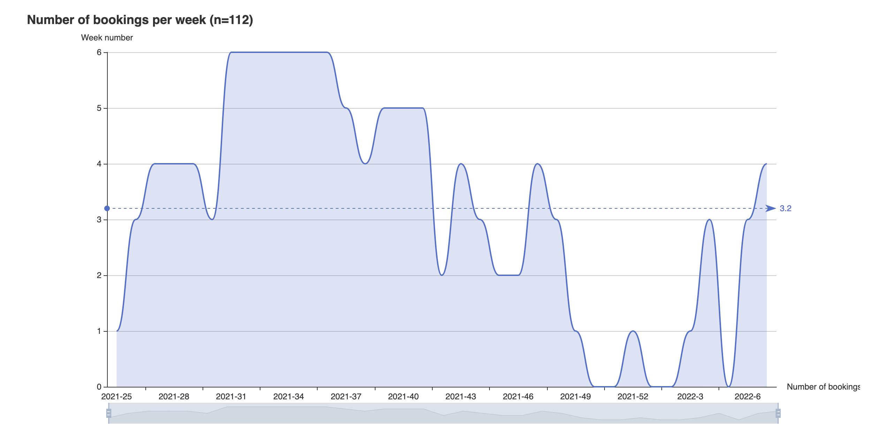

# bsport-charts

CLI tool to generate booking charts from the [bsport](https://bsport.io) API.

It uses [go-echarts](https://github.com/go-echarts/go-echarts) to generate the visualizations.

## Installation

Grab the latest binary from the releases, or build it yourself!

## Usage

```
➜ ./bsport-charts -help
Usage of ./bsport-exporter:
  -member string
        BSport member ID
  -token string
        BSport API token
```

Go on [backoffice.bsport.io](https://backoffice.bsport.io/) and inspect the network requests.

You can extract your member ID from the query string of some requests and your token from the authorization header of any request.

Then, launch the tool:

```
➜  ./bsport-charts -member xxxxxx -token xxxxxx
INFO[0001] Generated charts.html
```

And open the generated file in your browser.

## Demo

An example of the output is available in `./charts.example.html`.

### Heatmap of bookings per weekday and hour of the day


### Bookings per day of the week


### Bookings over time, grouped by week


